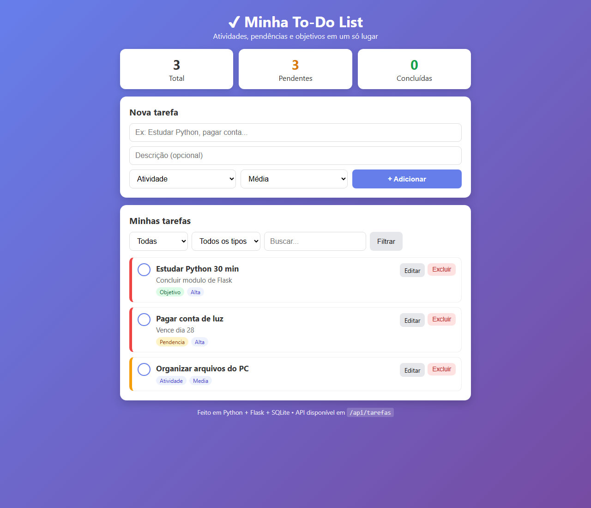

# ✔ To-Do List — Atividades, Pendências e Objetivos

Sistema simples e eficiente de lista de tarefas com **backend em Python (Flask + SQLite)** com CRUD completo e **frontend integrado em HTML + CSS**.



## ✨ Funcionalidades

- ➕ **Create:** adicionar tarefas com título, descrição, tipo e prioridade
- 📖 **Read:** listar, filtrar (todas / pendentes / concluídas), filtrar por tipo e buscar
- ✏️ **Update:** editar tarefa e marcar/desmarcar como concluída
- 🗑️ **Delete:** excluir tarefa com confirmação
- 🏷️ Tipos: `atividade`, `pendencia`, `objetivo`
- ⚡ Prioridades: `baixa`, `media`, `alta` (com cor na borda)
- 📊 Dashboard com contadores (total / pendentes / concluídas)
- 🔌 API REST JSON em `/api/tarefas` (GET, POST, PUT, DELETE)

## 🗂️ Estrutura do projeto

```
todo-list/
├── app.py              # Backend Flask + CRUD + SQLite
├── requirements.txt    # Dependências
├── Procfile            # Deploy (Heroku/Render)
├── render.yaml         # Deploy (Render)
├── runtime.txt         # Versão do Python no deploy
├── LICENSE             # Licença MIT
├── docs/
│   └── screenshot.png  # Print do sistema
├── templates/
│   ├── index.html      # Página principal
│   └── edit.html       # Página de edição
├── static/
│   └── style.css       # Estilos (frontend)
├── .gitignore
└── README.md
```

## 🚀 Como rodar

### 1. Pré-requisitos
- Python 3.10+ instalado

### 2. Instalar e executar

```bash
# Entrar na pasta
cd todo-list

# (Opcional) criar ambiente virtual
python -m venv venv
# Windows:
venv\Scripts\activate
# Linux/Mac:
# source venv/bin/activate

# Instalar dependências
pip install -r requirements.txt

# Rodar o app
python app.py
```

Acesse no navegador: **http://127.0.0.1:5000**

O banco SQLite (`todos.db`) é criado automaticamente na primeira execução.

## 🔌 API REST (exemplos)

```bash
# Listar
curl http://127.0.0.1:5000/api/tarefas

# Criar
curl -X POST http://127.0.0.1:5000/api/tarefas \
  -H "Content-Type: application/json" \
  -d "{\"titulo\":\"Estudar Python\",\"tipo\":\"objetivo\",\"prioridade\":\"alta\"}"

# Atualizar
curl -X PUT http://127.0.0.1:5000/api/tarefas/1 \
  -H "Content-Type: application/json" \
  -d "{\"concluida\":true}"

# Excluir
curl -X DELETE http://127.0.0.1:5000/api/tarefas/1
```

## 🛠️ Tecnologias

- **Backend:** Python 3 + Flask 3 + SQLite3 (stdlib)
- **Frontend:** HTML5 + CSS3 (responsivo, sem framework)
- **Banco:** SQLite (arquivo `todos.db`, zero configuração)

## 📤 Publicar no GitHub

```bash
cd todo-list
git init
git add .
git commit -m "feat: cria To-Do List com Flask, CRUD e frontend HTML/CSS"
git branch -M main
git remote add origin https://github.com/SEU-USUARIO/SEU-REPO.git
git push -u origin main
```

> Troque `SEU-USUARIO` e `SEU-REPO` pelos seus dados.

## 📝 Licença

Distribuído sob a licença MIT — veja o arquivo [LICENSE](LICENSE).

## ☁️ Deploy gratuito

### Render (recomendado)
1. Suba o código para o GitHub (este repo já inclui `Procfile`, `render.yaml` e `runtime.txt`).
2. Em [render.com](https://render.com) crie um **Web Service** a partir do repositório.
3. Build: `pip install -r requirements.txt` · Start: `gunicorn app:app`.
4. Pronto — o banco SQLite é criado automaticamente no primeiro acesso.

> Nota: no plano gratuito do Render o disco é efêmero (os dados somem a cada redeploy).
> Para dados permanentes, troque o SQLite por PostgreSQL gratuito do próprio Render.

### PythonAnywhere
1. Crie conta em [pythonanywhere.com](https://www.pythonanywhere.com).
2. Clone o repo, crie um virtualenv e instale `requirements.txt`.
3. Crie um app Flask apontando o WSGI para `app.py` (variável `app`).
4. Reload e acesse sua URL `seu-usuario.pythonanywhere.com`.
